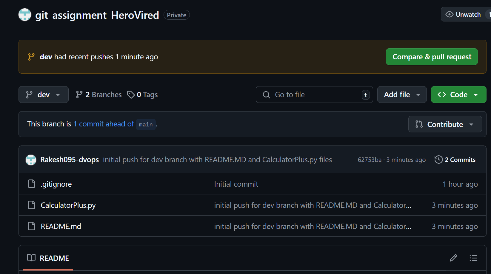
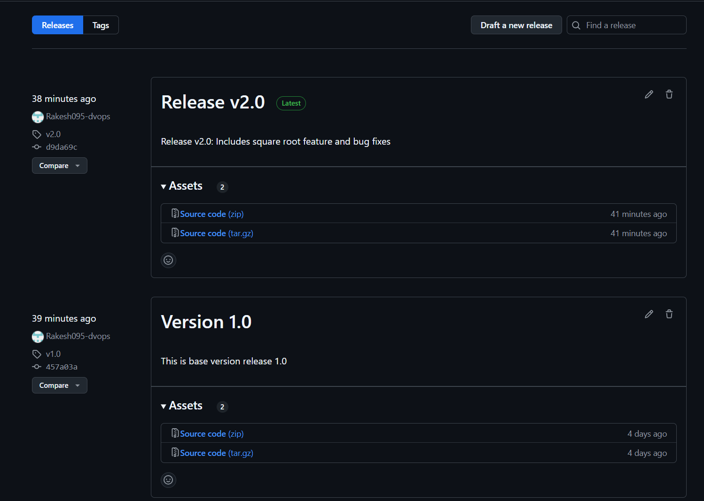

# git_assignment_HeroVired

Table Of Content
-
[Q1](#q1)  
[Q2](#q2)  
[Q3](#q3)

## Q1
 You are part of a development team working on a Python application called "CalculatorPlus." The application provides basic arithmetic operations, such as addition, subtraction, multiplication, and division. Your task is to implement a new feature that adds support for calculating the square root of a number.

### a. Create a repository name: git_assignment_HeroVired --------- [Done] 
```
Completed and create branch from Github and clone the private Repository - https://github.com/Rakesh095-dvops/git_assignment_HeroVired.git
```
### b. Create a ‘dev’ branch .Added the code and push to dev branch --------- [Done]
```
PS ~\git_assignment_HeroVired> git branch dev 
PS ~\git_assignment_HeroVired> git branch 
  dev
* main
PS ~\git_assignment_HeroVired> git checkout dev    
Switched to branch 'dev'
```

```
PS ~\git_assignment_HeroVired> git ls-files
.gitignore
README.md
PS ~\git_assignment_HeroVired> git add .
PS ~\git_assignment_HeroVired> git commit -m "initial push for dev branch with README.MD and CalculatorPlus.py files"
[dev 62753ba] initial push for dev branch with README.MD and CalculatorPlus.py files
 2 files changed, 52 insertions(+), 1 deletion(-)
 create mode 100644 CalculatorPlus.py

PS ~\git_assignment_HeroVired> git push origin dev   
Enumerating objects: 6, done.
Counting objects: 100% (6/6), done.
Delta compression using up to 8 threads
Compressing objects: 100% (4/4), done.
Writing objects: 100% (4/4), 1.18 KiB | 1.18 MiB/s, done.
Total 4 (delta 0), reused 0 (delta 0), pack-reused 0
remote: 
remote: Create a pull request for 'dev' on GitHub by visiting:
remote:      https://github.com/Rakesh095-dvops/git_assignment_HeroVired/pull/new/dev
remote:
To https://github.com/Rakesh095-dvops/git_assignment_HeroVired.git
 * [new branch]      dev -> dev

```
##### SnapShot 


```
push commit and updated the dev branch 
PS ~\git_assignment_HeroVired git status
On branch dev
nothing to commit, working tree clean

```
#### C. Merge this branch with the main branch and make a release of version 1 of the ‘calculator plus app’. --------- [Done]
1. Switch to the main branch:
2. Make sure your main branch is up-to-date
3. Merge the 'dev' branch into 'main'
4. Check for merge conflicts and resolve them.
    - git status will show you files with conflicts
    - Edit the conflicting files, then:
    - git add <conflicting_file>
    - git commit
5. Commit the change to Main
6. Create the release tag
7. Push everything to main.
```
PS ~git_assignment_HeroVired> git push origin dev
PS ~git_assignment_HeroVired> git checkout main
Switched to branch 'main'
Your branch is up to date with 'origin/main'.
PS ~git_assignment_HeroVired> git pull origin main
From https://github.com/Rakesh095-dvops/git_assignment_HeroVired
 * branch            main       -> FETCH_HEAD
Already up to date.
PS ~git_assignment_HeroVired> git merge dev
Updating 41768b9..457a03a
Fast-forward
 CalculatorPlus.py          |  31 +++++++++++++++++++++++++
 Images/dev_branch_push.png | Bin 0 -> 129564 bytes
 README.md                  |  55 ++++++++++++++++++++++++++++++++++++++++++++-
 3 files changed, 85 insertions(+), 1 deletion(-)
 create mode 100644 CalculatorPlus.py
 create mode 100644 Images/dev_branch_push.png
PS ~git_assignment_HeroVired> git commit -m "Merge dev branch into main, incorporating latest changes"
On branch main
Your branch is ahead of 'origin/main' by 3 commits.
  (use "git push" to publish your local commits)

nothing to commit, working tree clean
PS ~git_assignment_HeroVired> git status
On branch main
Your branch is ahead of 'origin/main' by 3 commits.
  (use "git push" to publish your local commits)

nothing to commit, working tree clean
PS ~git_assignment_HeroVired> git add .
PS ~git_assignment_HeroVired> git tag -a v1.0 -m "Release v1.0: Initial release after merging dev branch."
PS ~git_assignment_HeroVired> git push origin main --tags
Enumerating objects: 1, done.
Counting objects: 100% (1/1), done.
Writing objects: 100% (1/1), 195 bytes | 195.00 KiB/s, done.
Total 1 (delta 0), reused 0 (delta 0), pack-reused 0
To https://github.com/Rakesh095-dvops/git_assignment_HeroVired.git
   41768b9..457a03a  main -> main
 * [new tag]         v1.0 -> v1.0
```
### d. Add any of your classmates as collaborators. -[Done]
### e. Implement a feature by creating a new branch called ‘feature/sqrt’. -[Done]
### f. Add the ‘sqrt’ code to it.- [Done]
  1. @ssptr007 added as collborator . As a collborator i have created a pull request and shared to @ssptr007 & vice Versa. 
  2. I have cloned @ssptr007 repo main branch.  
  3. create a feature branch and add the code ```git checkout -b feature/sqrt``
  4. Implement the Square Root Feature 
        1. ```git add   ```
        2. ```git commit -m {comment}```
### g. While you are working on this feature, imagine that one critical bug is reported in the main branch, and you need to switch back to the ‘dev’ branch, create fixes, and apply them while keeping your ‘feature/sqrt’ branch up-to-date.-[Done]

  1. cloned our own repository again ```git clone {url}```
  2.  ```git checkout dev```
  3.  ```git pull origin dev```to Ensure your local dev branch is up-to-date
  4. Make bug fix directly on the `dev` branch 
  5. once done commit the changes ,test the code.
### h. After completing the feature implementation and ensuring that the application works correctly, create a pull request targeting the main branch.-[Done]
```
Create a pull request using Github and UI and test the same.

```

### i. Request a code review from a team member and make any necessary improvements based on the review feedback.-[Done]
```
Create a pull request and share the details to @ssptr007 
```

### j. Once the code reviewer approves your pull request, merge the "feature/sqrt" branch into the ‘dev’ branch. -[Done]
```
Code reviewer approve the request and add necessary comments from github GUI.
```

### k. Finally, do the testing in the ‘dev’ branch itself and merge it into the ‘main’ branch and create a ‘version 2’ release.-[Done]
1. rechecking the merge between feqture/Sqrt and dev locally using VS code. 
2. test dev branch code. 
3. test main branch code. 
4. As exception was outputing the results. comment test scenarios to have clean output. 
5. Now merge dev and main branch 
6. create tags v2.0 
7. Also create release tags v2.0 from GUI.

#### below mentioned are the list of commands used for above h -k 
```
git checkout {branch}
git pull origin {branch}
git merge {branch}
git commit -m {comment}
git push origin main
git tag -a v2.0 -m "Release v2.0: Includes square root feature and bug fixes"
git push origin v2.0
git push origin --tags
```


## Q2 
For a project that deals with large binary files, integrate Git LFS (Large File Storage) to handle these files efficiently. Demonstrate how to add, commit, and push binary files to the repository, ensuring they are tracked by Git LFS correctly. Clone the repository on another machine to verify that the binary files are downloaded correctly.

In the repository ‘git_assignment_HeroVired’, create a branch ‘lfs’. Upload any large file whose size is over ‘200mb’ and try to push this file into the repository

### a. upload large file whose >‘200mb’ , Push to Repo --------- [Done] 
  - install git lfs
  - create the repo lfs
  - run BinaryFileCreation.py to generate file > 200 mb 
  - track the file using ```git track```
  - stage, commit, and push the `.gitattributes` file and the binary files 
```
PS ~git_assignment_HeroVired> git lfs install
Updated Git hooks.
Git LFS initialized.
 
PS ~git_assignment_HeroVired> git branch lfs
PS ~git_assignment_HeroVired> git branch 
  dev
* feature/sqrt
  lfs
  main
PS ~git_assignment_HeroVired> git checkout lfs
Switched to branch 'lfs'

PS ~git_assignment_HeroVired> python .\BinaryFileCreation.py
Successfully created file: my_large_file.dat (300 MB)

PS ~git_assignment_HeroVired> git lfs track "my_large_file.dat"  
Tracking "my_large_file.dat"
PS ~git_assignment_HeroVired>  git lfs track "*.bin"
Tracking "*.bin"
PS ~git_assignment_HeroVired>  git lfs track "*.bin"
Tracking "*.bin"
PS ~git_assignment_HeroVired>  git lfs track "*.dat"
Tracking "*.dat"
PS ~git_assignment_HeroVired> git add .gitattributes
PS ~git_assignment_HeroVired> git add  .\BinaryFileCreation.py
PS ~git_assignment_HeroVired> git add .\my_large_file.dat

PS ~git_assignment_HeroVired> git commit -m "Add large binary file (my_large_file.dat) and Git LFS configuration"
[lfs 237f872] Add large binary file (my_large_file.dat) and Git LFS configuration
 3 files changed, 44 insertions(+)
 create mode 100644 .gitattributes
 create mode 100644 BinaryFileCreation.py
 create mode 100644 my_large_file.dat

PS ~git_assignment_HeroVired> git push origin lfs
Uploading LFS objects: 100% (1/1), 315 MB | 11 MB/s, done.
Enumerating objects: 6, done.
Counting objects: 100% (6/6), done.
Delta compression using up to 8 threads
Compressing objects: 100% (5/5), done.
Writing objects: 100% (5/5), 1.25 KiB | 640.00 KiB/s, done.
Total 5 (delta 0), reused 0 (delta 0), pack-reused 0
remote: 
remote: Create a pull request for 'lfs' on GitHub by visiting:
remote:      https://github.com/Rakesh095-dvops/git_assignment_HeroVired/pull/new/lfs
remote:
To https://github.com/Rakesh095-dvops/git_assignment_HeroVired.git
 * [new branch]      lfs -> lfs

```
### b. Clone the repository on another machine to verify that the binary files are downloaded correctly.----[Done]
  - clone the Git Repository ```git clone <repository_url>```
  - install Git LFS ``` git lfs install ```
  - checkout the Relevant Branch i.e lfs```git checkout <branch_name> ```
  - Verify the File Size 
    ```
    PS ~> Get-ChildItem .\my_large_file.dat | ForEach-Object {$_.Length / (1MB)}
    300
    ```

## Q3
 In this same GitHub repository, create a new branch ‘geometry-calculator’, we'll work on a simple Python program that calculates the area of a circle and the area of a rectangle. 

   - created a geometry-calculator branch and create a new python file and save the provided code. 
  - push the code and created geometry-calculator branch.

 ```
 PS ~> git branch        
  dev
* main
PS ~> git checkout -b geometry-calculator
Switched to a new branch 'geometry-calculator'
PS ~> git branch
  dev
* geometry-calculator
  main
PS ~> git  add .
PS ~> git status
On branch geometry-calculator
Changes to be committed:
  (use "git restore --staged <file>..." to unstage)
        new file:   geometryCalc.py

PS ~> python .\geometrycalc.py
PS ~> git commit -m "initial gemometry-calculator commit"

```
Workflow Steps:

a. Create a new branch named "feature/circle-area" to work on the circle area feature - [Done]
 
```
PS ~> git checkout -b feature/circle-area
Switched to a new branch 'feature/circle-are
```

b. Stash Changes for Circle Area Feature:-[Done]

- Before committing the changes, stash them using git stash to save the incomplete feature implementation.

- Verify that the working directory is clean

```
PS ~> python .\geometrycalc.py
The area of the circle with radius 5 =78.53981633974483
PS ~> git status
On branch feature/circle-area
Changes not staged for commit:
  (use "git add <file>..." to update what will be committed)
  (use "git restore <file>..." to discard changes in working directory)
        modified:   geometryCalc.py

no changes added to commit (use "git add" and/or "git commit -a")
PS ~> git add .
PS ~> git status
On branch feature/circle-area
Changes to be committed:
  (use "git restore --staged <file>..." to unstage)
        modified:   geometryCalc.py

PS ~> git stash push -m " tested circle area feature"
Saved working directory and index state On feature/circle-area:  tested circle area feature
PS ~> git status
On branch feature/circle-area
nothing to commit, working tree clean
PS ~> git stash push -m " tested circle area feature"
Saved working directory and index state On feature/circle-area:  tested circle area feature
PS ~> git status
On branch feature/circle-area
nothing to commit, working tree clean
PS ~> git stash show
 geometryCalc.py | 4 ++--
 1 file changed, 2 insertions(+), 2 deletions(-)
PS ~> git stash list
stash@{0}: On feature/circle-area: tested circle area feature
```
c. Create a New Branch for Rectangle Area Feature: -[Done]
  - Create a new branch named "feature/rectangle-area" to work on the rectangle area

```
PS ~> git checkout -b feature/rectangle-area
Switched to a new branch 'feature/rectangle-area'
```
d. Stash Changes for Rectangle Area Feature: -[Done]
- Before committing the changes, stash them using git stash to save the incomplete feature implementation.
- Verify that the working directory is clean
```
PS ~> python .\geometrycalc.py
The area of the rectangle with length 10 and width 6 = 60
PS ~> git add .
PS ~> git status    
On branch feature/rectangle-area
Changes to be committed:
  (use "git restore --staged <file>..." to unstage)
        modified:   geometryCalc.py

PS ~> git stash list
stash@{0}: On feature/circle-area: tested circle area feature
PS ~> git stash push -m "tested rectangle area feature"
Saved working directory and index state On feature/rectangle-area: tested rectangle area feature
PS ~> git stash list
stash@{0}: On feature/rectangle-area: tested rectangle area feature
stash@{1}: On feature/circle-area: tested circle area feature
PS ~> git status    
On branch feature/rectangle-area
nothing to commit, working tree clean

````

e. Switch Back to Circle Area Branch  - [Done]

- Switch back to the "feature/circle-area" branch to continue working on the circle area feature.

- Retrieve the stashed changes

- Complete the circle area feature implementation and save the changes. 

```
PS ~> git stash pop --index -q 'stash@{1}'
PS ~> git branch
  dev
* feature/circle-area
  feature/rectangle-area
  geometry-calculator
  main
PS ~> python .\geometrycalc.py
The area of the circle with radius 5 =78.53981633974483

```

f. Commit and Push Circle Area Feature: -[Done]
```
PS ~> git add .
PS ~> git commit -m "Complete circle area feature implementation"
```
g. Switch Back to Rectangle Area Branch: -[Done]

- Switch back to the "feature/rectangle-area" branch to continue working on the rectangle area feature.
- Retrieve the stashed changes
- Complete the rectangle area feature implementation and save the changes. 

```
PS ~> git checkout feature/rectangle-area
Switched to branch 'feature/rectangle-area'
PS ~> git stash pop 
PS ~> python .\geometrycalc.py
The area of the rectangle with length 10 and width 6 = 60

```
h. Commit and Push Rectangle Area Feature

```
PS ~> git add .
PS ~> git commit -m "Complete rectangle area feature implementation"
[feature/rectangle-area 7c0ae9a] Complete rectangle area feature implementation
 1 file changed, 6 insertions(+), 5 deletions(-)
PS ~> git push origin feature/rectangle-area
Enumerating objects: 5, done.
Counting objects: 100% (5/5), done.
Delta compression using up to 8 threads
Compressing objects: 100% (3/3), done.
Writing objects: 100% (3/3), 357 bytes | 357.00 KiB/s, done.
Total 3 (delta 2), reused 0 (delta 0), pack-reused 0
remote: Resolving deltas: 100% (2/2), completed with 2 local objects.
remote: 
remote: Create a pull request for 'feature/rectangle-area' on GitHub by visiting:
remote:      https://github.com/Rakesh095-dvops/git_assignment_HeroVired/pull/new/feature/rectangle-area
remote:
To github.com:Rakesh095-dvops/git_assignment_HeroVired.git
 * [new branch]      feature/rectangle-area -> feature/rectangle-area

 ```
i. Create Pull Requests and review and merge everything to main branch
  - Click the "Compare & pull request" button. from repository. 
      - geometry-calculator branch to feature/rectangle-area
      - geometry-calculator branch to feature/circle-area 
  - once review has been completed and merged geometry-calculator 
  - Set the base branch to `dev` (if your target branch is 'dev') ,create  "Compare & pull request" with  geometry-calculator 
  - once review and merged to `dev` to `main`